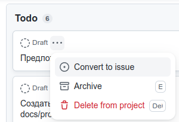
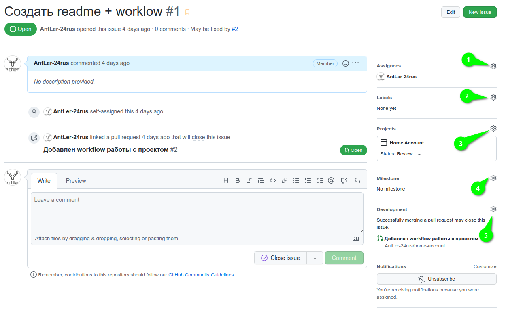

# Порядок создания Issue <!-- omit in toc -->

- [1. Создание Issue из канбан карточки](#1-создание-issue-из-канбан-карточки)
- [2. Работа с issue](#2-работа-с-issue)

## 1. Создание Issue из канбан карточки

Для создания issue из карточки канбан доски (Draft) необходимо в контекстном меню (`...`) выбрать `Convert to issue` что повлечет за собой преобразования черновика в issue

Если к карточке были прикреплены ответственные они так же перенесутся в issue, также можно назначить ответственных уже в созданном issue (см. №1 скрин ниже).

## 2. Работа с issue

GitHub автоматически присваивает номер к каждому issue, его можно посмотреть в заголовке после символа `#`. Также GitHub поддерживает перекрестные ссылке на уже созданные issue и PR достаточно просто указать `#<номер>` в любом комментарии или описании.

На скриншоте цифрами обозначены следующие области:

1. Ответственные за данные issue.
2. Ярлыки данного issue. Правилом хорошего тона будет указать соответствующий тематике issue ярлык или ярлыки.
3. Проект к которому привязан issue, если issue был создан из черновика (см. [Создание Issue из канбан карточки](#1-создание-issue-из-канбан-карточки)) номер вставится автоматически, иначе необходимо выбрать вручную.
4. К какому из основных этапов принадлежит issue, подробнее смотри [milestones](milestones.md)
5. Привязанные к issue PR, можно указывать в ручную из текущего интерфейса, однако лучше указывать внутри PR, подробнее смотри [PR](pull-request.md)

Все обсуждения рекомендуется вести внутри конкретного issue в секции комментариев.