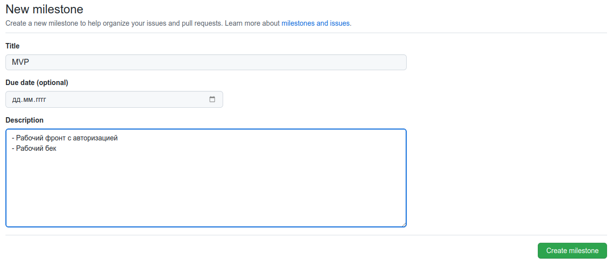

# Порядок работы с milestones <!-- omit in toc -->

Milestones - основные этапы разработки приложения с кратким описание чего хотим достичь. Также возможно указание даты завершения этапа.

Например:

