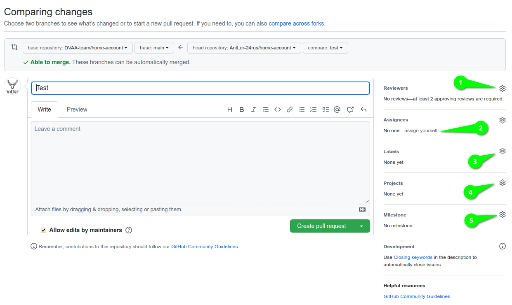

# Порядок работы с pull request (PR) <!-- omit in toc -->

- [1. Создание](#1-создание)
- [2. Merge](#2-merge)
- [3. Решение конфликтов слияния](#3-решение-конфликтов-слияния)

## 1. Создание

При создании PR заголовок указывать на русском языке (без номеров и прочего), кратко описывающий решаемую проблему или суть вносимых изменений.

Правилом хорошего тона будет написание подробного комментария к PR, что сделано, какие есть нюансы и т.д. Также в комментариях **необходимо** указать ключевое слово `Close` или другое см. [подробнее](https://docs.github.com/en/issues/tracking-your-work-with-issues/linking-a-pull-request-to-an-issue) и перечислить номера issues которые закроет merge этого PR в формате `Close #1 #2`



На скриншоте цифрами обозначены следующие области:

1. Предполагаемые ревьюеры. При создании PR правилом хорошего тона будет сразу указать ревьюеров.
2. Ответственные за данные PR, для назначения себя достаточно нажать `assign yourself`.
3. Ярлыки данного PR. Правилом хорошего тона будет указать соответствующий тематике PR ярлык или ярлыки.
4. Проект к которому привязан PR. Также является правилом хорошего тона указывать к какому проекту относиться данный PR.
5. К какому из основных этапов принадлежит PR, подробнее смотри [milestones](milestones.md)

## 2. Merge

Для успешного merge в основную ветку необходимо чтобы как минимум два члена команды подтвердили данные PR после ревью, иначе возможность merge будет заблокирована.

Мержить PR в основную ветку необходимо через функции `squash & merge`, обратите внимание что данная опция **не выбрана** автоматически по умолчанию.

Сообщение коммита формируется по такому же принципу как описано в [workflow](workflow.md#1-git) за исключением того что в него обязательно добавляется номер PR в скобочках после основного сообщения `fix: исправлены ошибки авторизации (#67)`. Все сообщения коммитов из сливаемой ветки вносятся в описание коммита, например:

```
feat: добавлена генерация хеша UUID
  Возникла необходимость сравнивать объекты между собой.

fix(utils): исправлена ошибка падения при появлении юникод символов
  Краткое описание исправленной ошибки.
  BREAKING-CHANGE: метод encode больше не выбрасывает ошибку.

feat(utils): добавлен метод encode
  Метод используется для преобразования строк 
```
## 3. Решение конфликтов слияния

> _НЕ ОЧЕВИДНО_: Для разрешения конфликтов `package-lock.json` файла достаточно в процессе merge\`а в терминале выполнить команду `npm install`, которая объединит текущие дерево зависимостей/подзависимостей с тем которое вливается. [Официальная дока npm](https://docs.npmjs.com/cli/v6/configuring-npm/package-locks#resolving-lockfile-conflicts)